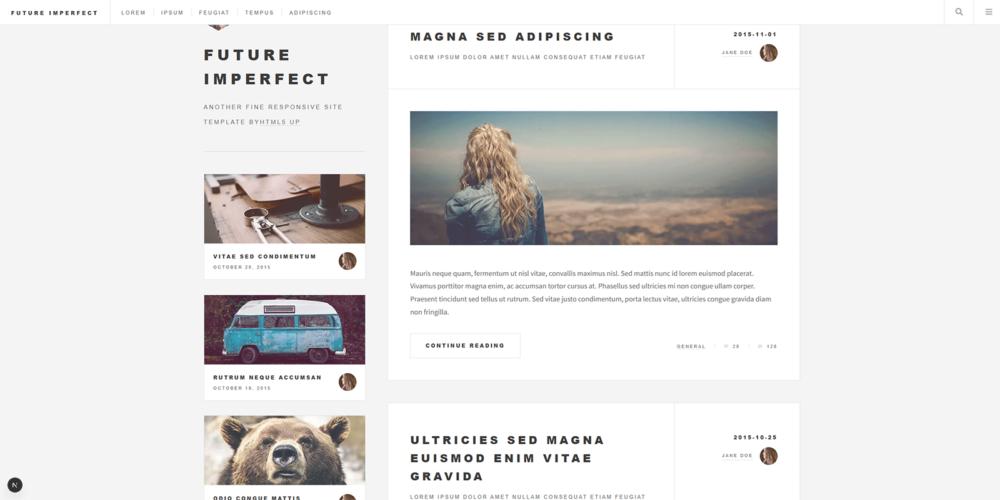

# Next.js Blog Example

A blog example built with Next.js 15 and React 19.

## 📦 Repository

This project is part of a code samples collection:
- **Repository**: [https://github.com/olsborn/code-samples.git](https://github.com/olsborn/code-samples.git)
- **Folder**: `02-next.js-blog-example`

## ️ Technologies

- **Next.js** 15.5.4 (Turbopack)
- **React** 19.1.0
- **Font Awesome** - icons
- **Source Sans Pro** - font

## 📁 Project Structure

```
02-next.js-blog-example/
├── app/                    # Next.js App Router routing
│   ├── layout.js          # Main layout
│   ├── page.js            # Homepage
│   ├── single/            # Single post
│   └── *.css              # Styling
├── components/            # React components
│   ├── BlogArticle.js    # Blog article
│   ├── Header.js         # Header
│   ├── Footer.js         # Footer
│   ├── PostListItem.js   # Post list item
│   └── ...
└── public/               # Static assets
```

## 🚀 Installation and Running

### Install dependencies

```bash
npm install
```

### Run in development mode

```bash
npm run dev
```

The application will be available at [http://localhost:3000](http://localhost:3000)

### Production build

```bash
npm run build
npm start
```

### Linting

```bash
npm run lint
```

## 📝 Description

The project presents a sample blog implementation with:
- Responsive design
- Mobile menu
- Blog post list
- Single post page
- Reusable components

This project is based on a free HTML5 UP template.
Design by HTML5 UP (html5up.net).
Converted to Next.js for learning purposes.

## 🎬 Demo



## 📄 License

Educational project - code example.
