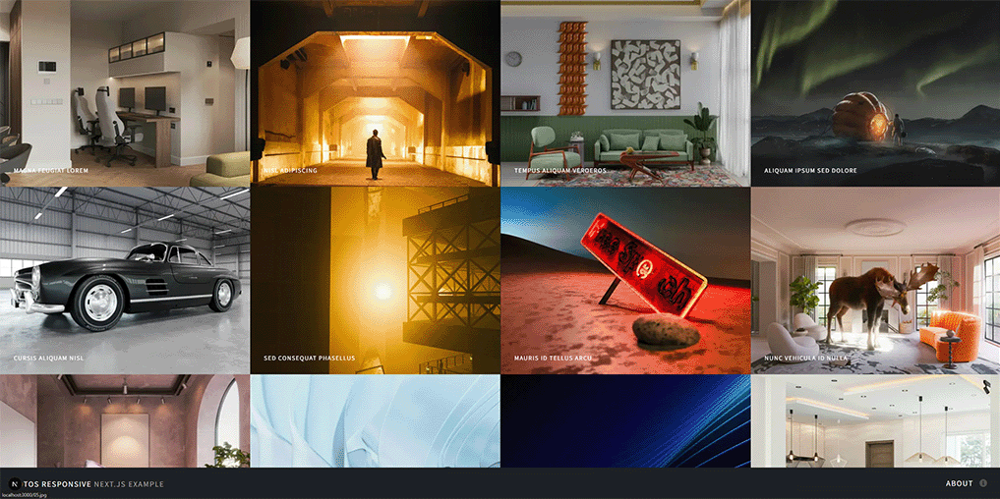

# Next.js Gallery Example

## Repository Information

- **Git Repository**: https://github.com/olsborn/code-samples.git
- **Subfolder**: `03-next.js-gallery-example`

## Description

This is a Next.js gallery application example with GLightbox integration for image viewing.

## Getting Started

```bash
npm install
npm run dev
```

Open [http://localhost:3000](http://localhost:3000) to view the application.

## Features

- Next.js application structure
- Gallery with GLightbox
- Responsive design
- Font Awesome icons integration
- AOS (Animate On Scroll) animations

## 🎬 Demo



## 📄 License

This project is licensed under the GNU General Public License v3.0 (GPL-3.0).
