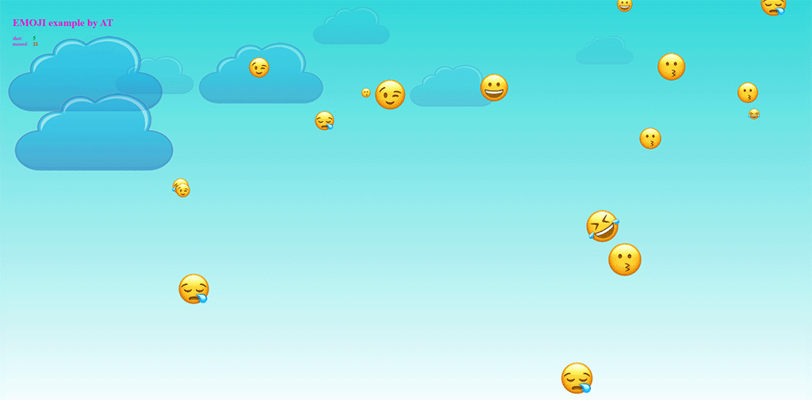

# 🎈 Emoji Shooter Game

A simple arcade game in JavaScript using jQuery, where the player's goal is to click on appearing emoji/balloons before they disappear from the screen.

## 📋 Description

The game involves clicking on emoji falling (or floating) on the screen. Emojis appear randomly and move up the screen. The player must click on them before they disappear from view. The game tracks the number of hits (shot) and missed attempts (missed).

## 🎮 Features

- **Dynamic emoji spawning** - random generation of emojis in different places on the screen
- **Progressive difficulty** - the game becomes increasingly difficult over time (emojis move faster)
- **6 different emojis** - randomly selected emoji graphics
- **Animated background** - decorative clouds moving in the background
- **Scoring system** - tracking hits and missed emojis
- **Responsive design** - adapts to window size

## 🚀 Installation and Launch

1. Clone the repository:
```bash
git clone https://github.com/olsborn/code-samples.git
cd code-samples/04-js-simple-shooter-game
```

2. Open the `index.html` file in a web browser:
   - Double-click on the `index.html` file, or
   - Run a local server (e.g., Live Server in VS Code)

**Note:** The game does not require installation of additional dependencies - jQuery is included locally.

## 🎬 Demo



## 📁 Project Structure

```
04-js-simple-shooter-game/
├── index.html          # Main HTML file with game logic
├── css/
│   └── style.css      # CSS styles and animations
├── js/
│   └── jquery-3.6.0.min.js  # jQuery library
└── images/
    ├── em1.png        # Emoji graphics (1-6)
    ├── em2.png
    ├── em3.png
    ├── em4.png
    ├── em5.png
    ├── em6.png
    └── cloud.png      # Cloud graphic
```

## 🎯 How to Play

1. Open the game in a browser
2. Emojis start appearing at the bottom of the screen and float upward
3. Click on emojis before they disappear from the top edge of the screen
4. Watch your results:
   - **shot** (green) - number of hits
   - **missed** (red) - number of missed emojis

## 🛠️ Technologies

- **HTML5**
- **CSS3** - animations, gradients, responsive layout
- **JavaScript** - game logic
- **jQuery 3.6.0** - DOM manipulation and event handling

## 📝 Technical Details

### Main Game Mechanics:

- **Game Loop**: Main loop runs with 10ms interval (`setInterval`)
- **Spawning**: Emojis are generated randomly with increasing frequency
- **Physics**: Each emoji has an individual speed coefficient
- **Collisions**: Click detection using jQuery event handlers
- **Animations**: CSS keyframes for fadeOut effects and cloud movements

### Configuration Variables in Code:

- Max number of emojis on screen: 18
- Delay between spawns: min. 750ms
- Difficulty increase: +0.015 per new emoji
- Emoji size: random 30-120px

## 🎨 Customization

You can easily customize the game:
- Change emoji images in the `images/` folder
- Adjust colors in `css/style.css`
- Modify difficulty by changing parameters in `EMOJIA_APP` (index.html)
- Add new background elements or visual effects

## 📄 License

Demo project - free for educational and personal use.

## 👤 Author

**olsborn**
- GitHub: [@olsborn](https://github.com/olsborn)
- Repository: [code-samples](https://github.com/olsborn/code-samples)

---

**Przykład gry z portfolio demonstracyjnych projektów JavaScript**
