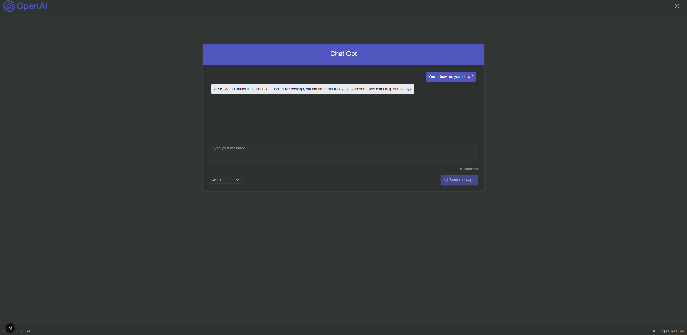

# Next.js OpenAI Chat - Simplified Version

A chat application with OpenAI integration built with Next.js 15 and React 19. Simple interface for communicating with GPT models.

## 📋 Requirements

- **Node.js** version 20.x or newer
- **npm** or **yarn**
- **OpenAI API Key**

## 🔑 How to Get OpenAI API Key

1. Go to [OpenAI Platform](https://platform.openai.com/)
2. Sign in or create a new account
3. Navigate to [API Keys](https://platform.openai.com/api-keys) section
4. Click **"Create new secret key"** button
5. Give your key a name (optional) and click **"Create secret key"**
6. **IMPORTANT:** Copy the generated key and save it in a secure place - you won't be able to see it again!

### Cost Notice
- OpenAI API is paid - check the [pricing](https://openai.com/api/pricing/)
- New users may receive free credits to start
- Monitor your usage in the [usage dashboard](https://platform.openai.com/usage)

## 🎬 Demo



## 🚀 Installation

1. **Clone the repository:**
   ```bash
   git clone https://github.com/olsborn/code-samples.git
   cd code-samples/05-next.js-openAI-chat-simplified
   ```

2. **Install dependencies:**
   ```bash
   npm install
   ```
   or
   ```bash
   yarn install
   ```

3. **Configure environment variables:**
   
   Create a `.env.local` file in the project root directory:
   ```bash
   touch .env.local
   ```
   
   Add your OpenAI API key:
   ```env
   OPENAI_API_KEY=your-openai-api-key
   ```
   
   **Example:**
   ```env
   OPENAI_API_KEY=sk-proj-abc123xyz789...
   ```

## 🏃‍♂️ Running the Project

### Development Mode

```bash
npm run dev
```

The application will be available at: [http://localhost:3000](http://localhost:3000)

### Production Build

```bash
# Build the application
npm run build

# Run the production application
npm start
```

## 🛠️ Technologies

- **Next.js 15.5.4** - React framework with server-side rendering
- **React 19.1.0** - Library for building user interfaces
- **OpenAI API 6.2.0** - Integration with GPT models
- **TypeScript 5** - Typed JavaScript
- **Lucide React** - Icons

## 📁 Project Structure

```
.
├── app/
│   ├── api/
│   │   └── chat/
│   │       └── route.ts        # OpenAI API endpoint
│   ├── layout.tsx              # Main layout
│   ├── page.tsx                # Home page
│   └── error.tsx               # Error handling
├── chatapp/
│   ├── ChatApp.tsx             # Main chat component
│   ├── ChatContainer.tsx       # Chat container
│   └── ErrorCatcher.tsx        # Error handling
├── components/
│   ├── Header.tsx              # Header
│   ├── Footer.tsx              # Footer
│   └── ThemeSwitcher.tsx       # Theme switcher
├── public/                     # Static files
├── .env.local                  # Environment variables (to create)
├── package.json
└── README.md
```

## ⚠️ Troubleshooting

### Error: "OPENAI_API_KEY is missing from environment variables"

**Cause:** Missing API key in environment variables.

**Solution:**
1. Check if you created the `.env.local` file
2. Make sure the key has the correct name: `OPENAI_API_KEY`
3. Restart the development server after adding the key

### Error: "Invalid API key"

**Cause:** Invalid or inactive API key.

**Solution:**
1. Generate a new API key at [OpenAI Platform](https://platform.openai.com/api-keys)
2. Make sure you copied the entire key
3. Check if the key hasn't expired

### Error: "Rate limit exceeded"

**Cause:** API request limit exceeded.

**Solution:**
- Wait a moment before the next request
- Check your plan limits in OpenAI
- Consider upgrading your plan if you frequently exceed limits

## 📄 License

This project is part of a code samples repository.

## 🔗 Links

- **GitHub Repository:** [https://github.com/olsborn/code-samples](https://github.com/olsborn/code-samples)
- **OpenAI Platform:** [https://platform.openai.com/](https://platform.openai.com/)
- **Next.js Documentation:** [https://nextjs.org/docs](https://nextjs.org/docs)
- **OpenAI API Documentation:** [https://platform.openai.com/docs](https://platform.openai.com/docs)

## 💡 Tips

- Use `gpt-3.5-turbo` model for cheaper requests
- `gpt-4` model provides better responses but is more expensive
- Always monitor API usage to avoid unexpected costs
- Don't share your API key publicly
- Add `.env.local` to `.gitignore` (should already be included)

---

**Author:** [olsborn](https://github.com/olsborn)<br>
**Last Updated:** March 2026
