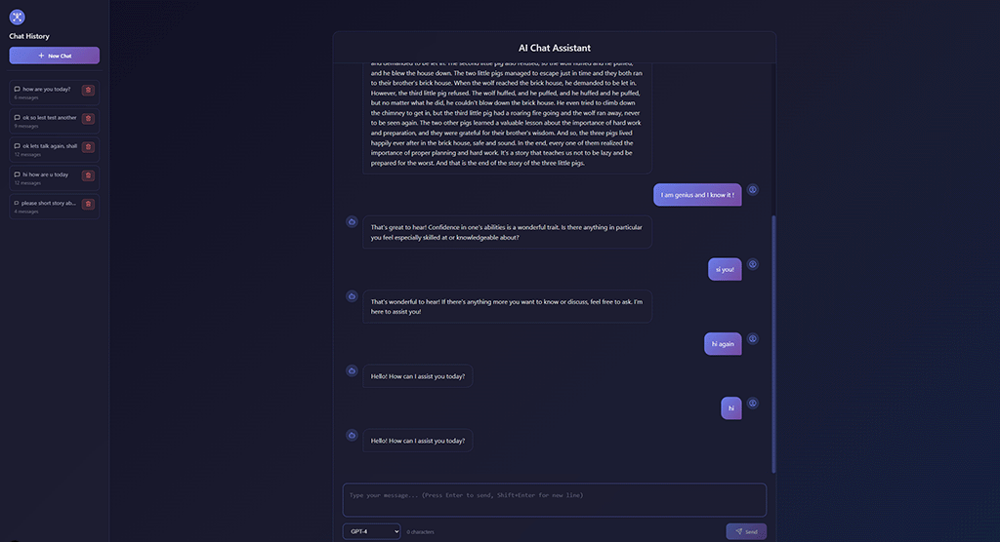

# Next.js OpenAI Chat with Socket.IO and UI

This is a [Next.js](https://nextjs.org) project showcasing a real-time chat application with OpenAI integration using Socket.IO for WebSocket communication.

**Repository:** [https://github.com/olsborn/code-samples.git](https://github.com/olsborn/code-samples.git)

---

## Prerequisites

- **Node.js** (recommended LTS version)
- **npm** or **yarn**
- **OpenAI API Key** (see instructions below)

---

## Getting the OpenAI API Key

To use this application, you need an OpenAI API key:

1. Go to [https://platform.openai.com/](https://platform.openai.com/)
2. Sign up or log in to your account
3. Navigate to **API Keys** section (or go directly to [https://platform.openai.com/api-keys](https://platform.openai.com/api-keys))
4. Click **"Create new secret key"**
5. Copy the generated API key (you won't be able to see it again!)
6. Store it securely - you'll need it in the next step

> **Note:** OpenAI API usage is not free. Make sure to review the [pricing](https://openai.com/pricing) and set up billing limits if needed.

---

## 🎬 Demo



### Video Demo

- [📺 YouTube Demo](https://youtu.be/Bo6og4-UvIs?si=0Y96UVl3aZM5yCFG)
- [📹 Download MP4](https://github.com/olsborn/code-samples/raw/main/06-next.js-openAI-chat_socket_io_and_ui/demo.mp4)

---

## Installation and Setup

### 1. Clone the Repository

```bash
git clone https://github.com/olsborn/code-samples.git
cd code-samples/06-next.js-openAI-chat_socket_io_and_ui
```

### 2. Install Frontend Dependencies

In the main project directory:

```bash
npm install
```

### 3. Configure the Socket.IO Backend Server

Navigate to the `server` directory:

```bash
cd server
npm install
```

Create a `.env` file in the `server` directory by copying the example file:

```bash
cp .env.example .env
```

Edit the `.env` file and add your OpenAI API key:

```env
OPENAI_API_KEY=your-api-key-here
PORT=4000
CLIENT_ORIGIN=http://localhost:3000
```

Replace `your-api-key-here` with the API key you obtained from OpenAI.

---

## Running the Application

### 1. Start the Socket.IO Backend Server

In the `server` directory:

```bash
npm start
```

For development with auto-reload:

```bash
npm run dev
```

The backend server will start on `http://localhost:4000` by default.

### 2. Start the Next.js Frontend

Return to the main project directory and run:

```bash
npm run dev
```

The frontend will start on `http://localhost:3000`.

> **Important:** Both servers must be running simultaneously for the chat app to work correctly.

---

## Build and Run (production)

### Build (TurboPack-optimized)

```bash
npm run build
```

### Start the compiled app

```bash
npm start
```

Open `http://localhost:3000` in your browser to see the production build.

---

## Project structure (high level)

- **app/** — application routes and project pages
- **chatapp/** — main chat app logic
- **components/** — UI components
- **public/** — static assets
- **server/** — Socket.IO + Express backend
- **package.json** — scripts and dependencies

---

## Learn more

- **Next.js Documentation**: https://nextjs.org/docs
- **Socket.IO Documentation**: https://socket.io/docs/v4
- **OpenAI API Docs**: https://platform.openai.com/docs/api-reference

---

## Deploy on Vercel

The easiest way to deploy a Next.js app is with the **Vercel** platform. See the Next.js deployment docs for configuration details and recommended settings: https://nextjs.org/docs/app/building-your-application/deploying

---

## License

This project is licensed under the GNU General Public License v3.0 (GPL-3.0).
