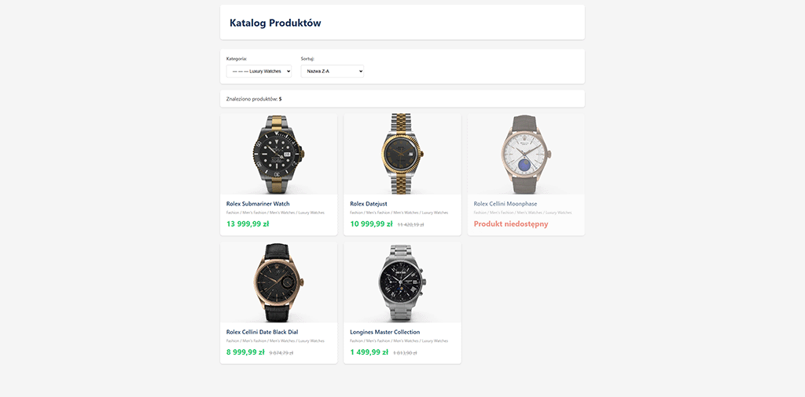

# Product Catalog - Sample Code

Demo aplikacji katalogu produktów z filtrowaniem i sortowaniem.

## Wymagania

- PHP 8.2+
- Rozszerzenie cURL (tylko w trybie online)

## 🎬 Demo



---

## Konfiguracja

Plik `config.php` zawiera:

- `OFFLINE_MODE` - tryb pracy (true = dane z plików JSON, false = dane z API)
- `API_URL` - adres API REST (używany tylko gdy OFFLINE_MODE = false)
- `API_AUTH_KEY` - klucz autoryzacji do API (używany tylko gdy OFFLINE_MODE = false)

### Tryb Offline (domyślny)

Aplikacja domyślnie działa w trybie offline, używając przykładowych danych z katalogu `data/`:

- `data/categories.json` - kategorie produktów
- `data/products.json` - lista produktów

Aby uruchomić w trybie offline, upewnij się że w `config.php`:

```php
const OFFLINE_MODE = true;
```

### Tryb Online

Aby połączyć się z prawdziwym API, ustaw w `config.php`:

```php
const OFFLINE_MODE = false;
const API_URL = 'https://your-api-url.com/rest.php';
const API_AUTH_KEY = 'your_api_key';
```

## Uruchomienie

1. Umieść pliki w katalogu serwera HTTP (np. XAMPP, WAMP)
2. Otwórz `index.php` w przeglądarce
3. Aplikacja działa od razu z przykładowymi danymi (tryb offline)

## Funkcjonalność

- Wyświetlanie produktów z API
- Filtrowanie po kategoriach (hierarchiczne)
- Sortowanie (nazwa A-Z/Z-A, cena rosnąco/malejąco)
  - Sortowanie uwzględnia polskie znaki diakrytyczne (ą, ć, ę, ł, ń, ó, ś, ź, ż)
  - Implementacja nie wymaga rozszerzenia PHP intl (Collator)
- Wyświetlanie ścieżki kategorii
- Oznaczanie produktów niedostępnych (quantity = 0)
- Responsywny layout

## Uwagi techniczne

- Sortowanie alfabetyczne używa zamiany polskich znaków na odpowiedniki łacińskie, co nie wymaga rozszerzenia intl
- Funkcja budowania drzewa kategorii zoptymalizowana - indeksowanie po parent_id zamiast wielokrotnego filtrowania

## Struktura projektu

```text
.
├── index.php           # Główny plik aplikacji
├── config.php          # Konfiguracja (OFFLINE_MODE, API_URL, API_AUTH_KEY)
├── ApiClient.php       # Klasa do obsługi API i trybu offline
├── style.css           # Style CSS
├── script.js           # JavaScript (obsługa filtrów)
├── data/
│   ├── categories.json # Przykładowe kategorie (tryb offline)
│   └── products.json   # Przykładowe produkty (tryb offline)
└── README.md           # Ten plik
```
