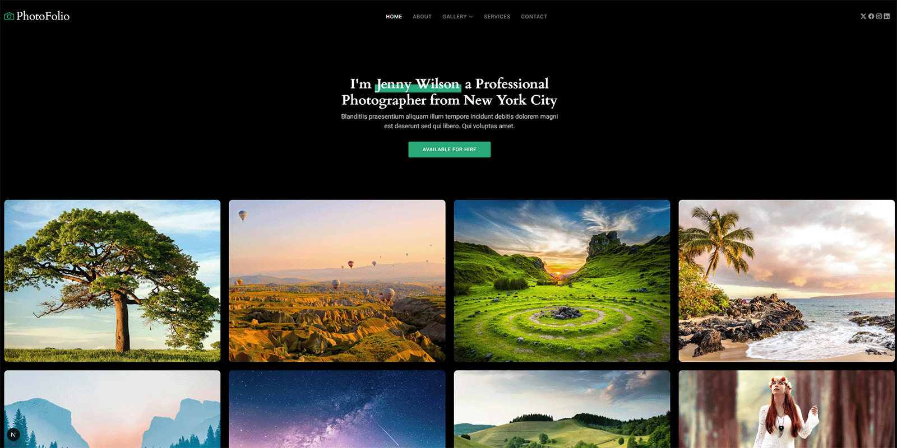
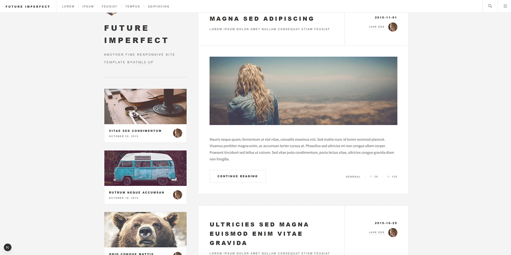
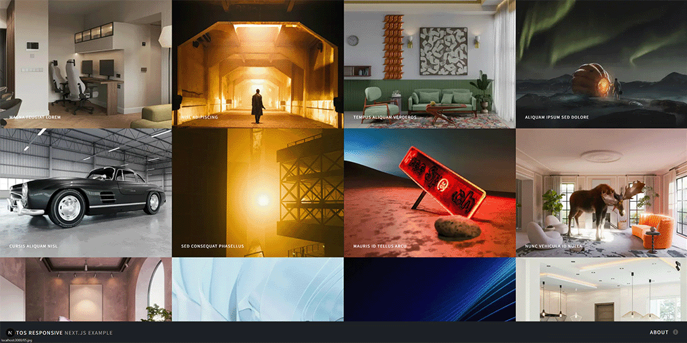
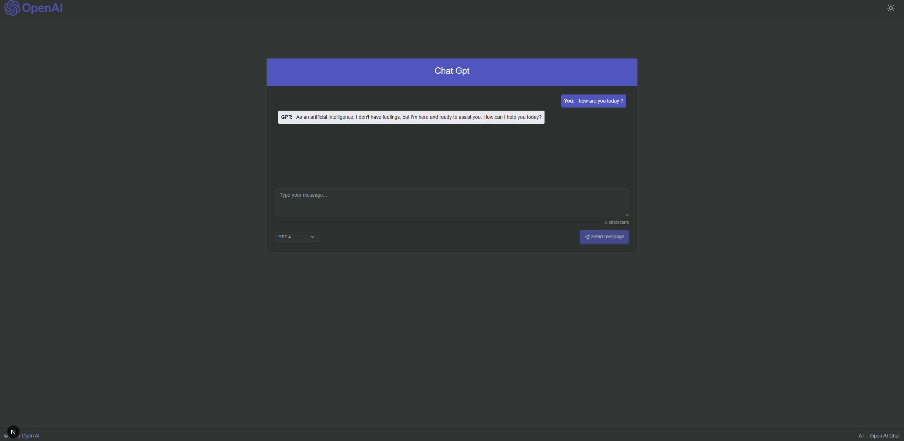
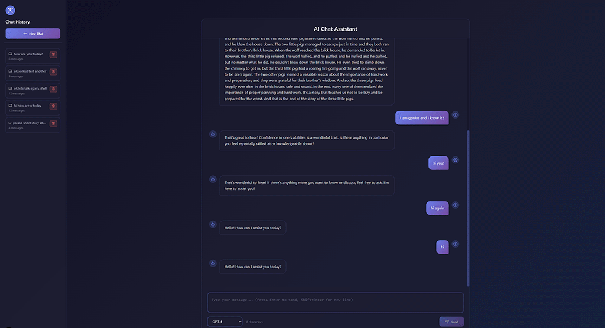
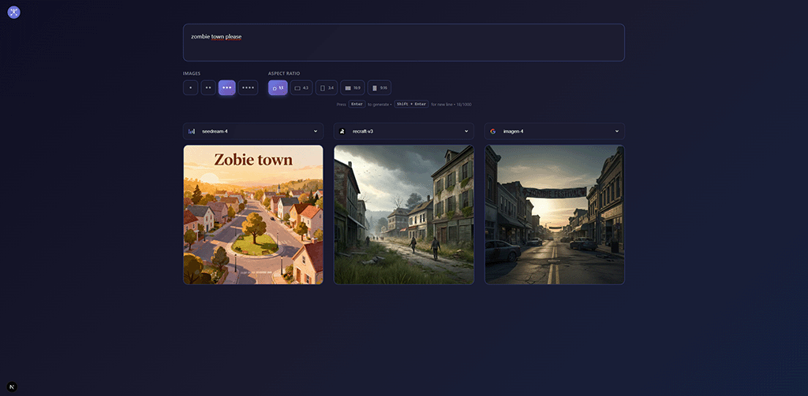
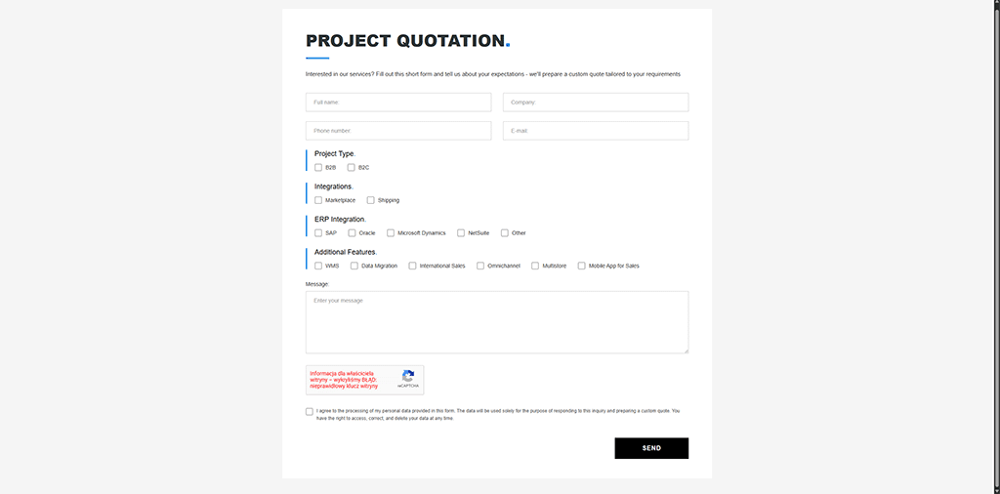

# Code Samples Repository

A collection of web development code samples and example projects showcasing various technologies, frameworks, and implementations. This repository serves as a portfolio of practical examples and learning resources for modern web development.

## 📚 Projects Overview

| # | Project | Description | Technologies |
|---|---------|-------------|--------------|
| 01 | [Landing Page Portfolio](#01-landing-page-portfolio) | Responsive landing page with animations | Next.js 15, React 19, Bootstrap 5, AOS |
| 02 | [Blog Example](#02-blog-example) | Clean blog implementation with responsive design | Next.js 15, React 19, Font Awesome |
| 03 | [Gallery Example](#03-gallery-example) | Image gallery with lightbox functionality | Next.js 15, GLightbox, AOS |
| 04 | [Emoji Shooter Game](#04-emoji-shooter-game) | Simple arcade browser game | JavaScript, jQuery, HTML5, CSS3 |
| 05 | [OpenAI Chat - Simplified](#05-openai-chat---simplified) | Basic chat interface for OpenAI GPT models | Next.js 15, React 19, OpenAI API, TypeScript |
| 06 | [OpenAI Chat with Socket.IO](#06-openai-chat-with-socketio) | Real-time chat with WebSocket communication | Next.js 15, Socket.IO, OpenAI API, TypeScript |
| 07 | [AI Image Generator](#07-ai-image-generator) | AI-powered image generation from text prompts | Next.js, Replicate API, TypeScript |
| 08 | [Product Catalog API Integration](#08-product-catalog-api-integration) | Product catalog with filtering and sorting | PHP 8.2+, REST API, JSON |
| 09 | [Project Quotation Form](#09-project-quotation-form) | Contact form with reCAPTCHA v2 and AJAX | PHP 7.4+, jQuery, reCAPTCHA v2 |

---

## 🚀 Getting Started

Each project is contained in its own directory with dedicated README files containing installation and usage instructions.

```bash
# Clone the repository
git clone https://github.com/olsborn/code-samples.git
cd code-samples

# Navigate to a specific project
cd 01-next.js-portfolio-example

# Follow the instructions in the project's README
```

---

## 📁 Detailed Project Descriptions

### 01. Landing Page Portfolio

**Location:** `01-next.js-portfolio-example/`

Responsive landing page featuring animations, image galleries, testimonials, and service pages. Built with Next.js App Router.

**Key Features:**
- Pages: Home, About, Services, Gallery, Contact
- Bootstrap design
- AOS, GLightbox, Swiper

**Tech Stack:** Next.js 15, React 19, Bootstrap 5, AOS, GLightbox, Swiper

**Demo:** 

---

### 02. Blog Example

**Location:** `02-next.js-blog-example/`

A clean and responsive blog implementation showcasing post listings, individual post pages, and mobile-friendly navigation.

**Key Features:**
- Blog post list view
- Single post detail pages
- Reusable component

**Tech Stack:** Next.js 15, React 19, Font Awesome, Source Sans Pro

**Demo:** 

---

### 03. Gallery Example

**Location:** `03-next.js-gallery-example/`

Simple image gallery application with integrated lightbox viewing made for testing Next.js IMAGE.

**Key Features:**
- GLightbox integration for image viewing
- Responsive gallery grid
- AOS

**Tech Stack:** Next.js, GLightbox, AOS, Font Awesome

**Demo:** 

---

### 04. Emoji Shooter Game

**Location:** `04-js-simple-shooter-game/`

A fun arcade-style browser game where players click on floating emoji before they disappear from the screen.

**Key Features:**
- Dynamic emoji spawning with random positioning
- Progressive difficulty (increasing speed)

**Tech Stack:** HTML5, CSS3, JavaScript, jQuery 3.6.0

**How to Play:** Open `index.html` in your browser and click on emojis before they float off the top of the screen!

**Demo:** 

---

### 05. OpenAI Chat - Simplified

**Location:** `05-next.js-openAI-chat-simplified/`

A streamlined chat application with OpenAI GPT model integration.

**Key Features:**
- Direct OpenAI API integration
- TypeScript
- Error handling with error boundaries

**Tech Stack:** Next.js 15, React 19, OpenAI API, TypeScript, Lucide React

**Requirements:** OpenAI API Key (see project README for setup instructions)

**Demo:** 

---

### 06. OpenAI Chat with Socket.IO

**Location:** `06-next.js-openAI-chat_socket_io_and_ui/`

Chat application using WebSocket communication for instant messaging with OpenAI GPT models.

**Key Features:**
- Real-time WebSocket communication
- Socket.IO backend server
- Multiple chat room support

**Tech Stack:** Next.js 15, React 19, Socket.IO, OpenAI API, TypeScript, Node.js backend

**Requirements:** 
- OpenAI API Key
- Backend server setup (see project README)

**Demo:** 
- 
- [📺 YouTube Demo](https://youtu.be/Bo6og4-UvIs?si=0Y96UVl3aZM5yCFG)

---

### 07. AI Image Generator

**Location:** `07-next.js-imageGenerator_AI_app/`

An AI-powered image generation application that creates images from text prompt using the Replicate API.

**Key Features:**
- Text-to-image generation
- Multiple AI model options
- Customizable aspect ratios
- Modern, responsive interface

**Tech Stack:** Next.js, React, Replicate API, TypeScript

**Requirements:** Replicate API Token (see project README for setup instructions)

**Demo:** 
- 
- [📺 YouTube Demo](https://youtu.be/UsXv98MmBbg?si=ZsykY3972FCb_H2w)

---

### 08. Product Catalog API Integration

**Location:** `08-php-simple-API-intergation/`

Product catalog application with filtering, sorting, and hierarchical categories. Works in offline mode with JSON data or online mode with REST API.

**Key Features:**
- Category filtering with hierarchical structure
- Sorting by name (A-Z/Z-A) and price
- Polish character support (ą, ć, ę, ł, ń, ó, ś, ź, ż)
- Offline/Online mode switching
- Product availability indicators
- Responsive layout

**Tech Stack:** PHP 8.2+, REST API, JSON, cURL

**Demo:** 

---

### 09. Project Quotation Form

**Location:** `09-php-simple-FROM-example/`

Contact form with Google reCAPTCHA v2 integration, AJAX validation, and test mode for development.

**Key Features:**
- AJAX form submission
- Client and server-side validation
- Google reCAPTCHA v2 integration
- Test mode (captcha optional)
- Loading spinner and success/error messages
- Responsive design

**Tech Stack:** PHP 7.4+, jQuery 4.0, Google reCAPTCHA v2, AJAX

**Demo:** 

---

This repository demonstrates proficiency in:

### Frontend
- **Next.js 15** - React framework with App Router
- **React 19** - Modern UI component library
- **TypeScript** - Type-safe JavaScript
- **Bootstrap 5** - CSS framework
- **Tailwind CSS** - Utility-first CSS
- **jQuery** - JavaScript library

### Styling & Animation
- **AOS (Animate On Scroll)** - Scroll animations
- **GLightbox** - Lightbox gallery
- **Swiper** - Touch sliders
- **Font Awesome** - Icon library

### Backend & APIs
- **PHP 8.2+** - Server-side scripting
- **OpenAI API** - GPT language models
- **Replicate API** - AI image generation
- **Socket.IO** - Real-time WebSocket communication
- **Node.js** - Backend server
- **REST API** - API integration
- **Google reCAPTCHA v2** - Bot protection

---

## 📋 Prerequisites

Most projects in this repository require:
- **Node.js** (version 15.0 or higher recommended)
- **npm**, **yarn**, **pnpm**, or **bun**

For AI-powered projects (05, 06, 07), you'll need:
- **OpenAI API Key** (projects 05, 06)
- **Replicate API Token** (project 07)

Refer to individual project README files for specific API key setup instructions.

---

## 🎯 Purpose

This repository serves multiple purposes:
- **Portfolio** - Showcasing various web development skills and implementations
- **Learning Resource** - Practical examples for studying modern web technologies
- **Code Reference** - Reusable patterns and component architectures
- **Experimentation** - Testing new frameworks, APIs, and development approaches

---

## 📝 License

This project is licensed under the GNU General Public License v3.0 (GPL-3.0).

---

## 👤 Author

**olsborn**
- GitHub: [@olsborn](https://github.com/olsborn)
- Repository: [code-samples](https://github.com/olsborn/code-samples)

---

## 🤝 Contributing

These are personal code samples and learning projects. Feel free to fork, study, and adapt the code for your own learning purposes.

---

## 📧 Contact

For questions or suggestions, feel free to open an issue in the repository.

---

## License

GNU GPL (General Public License)